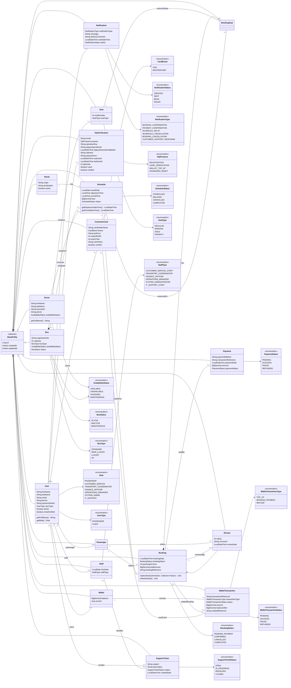

# SmartRoute Lanka Class Diagram

This class diagram focuses on the main domain model in `lk.smartroute.model`.
It can be pasted into any Mermaid-compatible Markdown viewer.

```mermaid
classDiagram
direction LR

class BaseEntity {
  <<abstract>>
  Long id
  Instant createdAt
  Instant updatedAt
}

class User {
  String firstName
  String lastName
  String email
  String phone
  String passwordHash
  UserType userType
  boolean active
  boolean emailVerified
  getFullName() String
  getRole() Role
}

class Passenger

class Staff {
  LocalDate hireDate
  StaffType staffType
}

class Driver {
  String firstName
  String lastName
  String licenseNo
  String phone
  AvailabilityStatus availabilityStatus
  getFullName() String
}

class Bus {
  String registrationNo
  int capacity
  BusType busType
  AvailabilityStatus availabilityStatus
  BusStatus status
}

class Seat {
  int seatNumber
  SeatType seatType
}

class Route {
  String origin
  String destination
  boolean active
}

class Schedule {
  LocalDate travelDate
  LocalTime departureTime
  LocalTime arrivalTime
  BigDecimal fare
  ScheduleStatus status
  getDepartureDateTime() LocalDateTime
  getArrivalDateTime() LocalDateTime
}

class Booking {
  LocalDateTime bookingDate
  BookingStatus bookingStatus
  int passengerCount
  BigDecimal totalAmount
  String bookingReference
  replaceSeats(Schedule, Collection~Seat~) void
  releaseSeats() void
}

class BookingSeat

class Payment {
  String paymentMethod
  String transactionReference
  LocalDateTime paymentDate
  BigDecimal amount
  PaymentStatus paymentStatus
}

class Review {
  int rating
  String comment
  LocalDateTime reviewDate
}

class Wallet {
  BigDecimal balance
  long version
}

class WalletTransaction {
  String transactionReference
  WalletTransactionType transactionType
  WalletTransactionStatus status
  BigDecimal amount
  BigDecimal balanceAfter
  String relatedReference
}

class CustomerCard {
  String cardholderName
  CardBrand brand
  String lastFour
  int expiryMonth
  int expiryYear
  String cardToken
  boolean verified
}

class OtpVerification {
  String email
  OtpPurpose purpose
  String operationKey
  String legacyOperationId
  LocalDateTime legacyResendAvailableAt
  String otpHash
  String payloadJson
  LocalDateTime expiresAt
  LocalDateTime lastSentAt
  int attempts
  boolean used
  boolean verified
}

class Notification {
  NotificationType notificationType
  String message
  String deliveryChannels
  LocalDateTime sentDateTime
  NotificationStatus status
}

class SupportTicket {
  String subject
  String description
  SupportTicketStatus status
  LocalDateTime createdDate
}

class AvailabilityStatus {
  <<enumeration>>
  AVAILABLE
  UNAVAILABLE
  ASSIGNED
  MAINTENANCE
}

class BookingStatus {
  <<enumeration>>
  PENDING_PAYMENT
  CONFIRMED
  CANCELLED
  COMPLETED
}

class BusStatus {
  <<enumeration>>
  ACTIVE
  INACTIVE
  MAINTENANCE
}

class BusType {
  <<enumeration>>
  STANDARD
  SEMI_LUXURY
  LUXURY
  AC
}

class CardBrand {
  <<enumeration>>
  VISA
  MASTERCARD
}

class NotificationStatus {
  <<enumeration>>
  CREATED
  SENT
  READ
  FAILED
}

class NotificationType {
  <<enumeration>>
  BOOKING_CONFIRMATION
  PAYMENT_CONFIRMATION
  SCHEDULE_DELAY
  SCHEDULE_CANCELLATION
  BOOKING_CANCELLATION
  CUSTOMER_SUPPORT_RESPONSE
}

class OtpPurpose {
  <<enumeration>>
  REGISTRATION
  CARD_VERIFICATION
  WALLET_TOP_UP
  PASSWORD_RESET
}

class PaymentStatus {
  <<enumeration>>
  PENDING
  SUCCESS
  FAILED
  REFUNDED
}

class Role {
  <<enumeration>>
  PASSENGER
  CUSTOMER_SERVICE
  TRANSPORT_COORDINATOR
  FINANCE_OFFICER
  OPERATIONS_MANAGER
  SYSTEM_ADMIN
  IT_SUPPORT
}

class ScheduleStatus {
  <<enumeration>>
  SCHEDULED
  DELAYED
  CANCELLED
  COMPLETED
}

class SeatType {
  <<enumeration>>
  REGULAR
  WINDOW
  AISLE
  PRIORITY
}

class StaffType {
  <<enumeration>>
  CUSTOMER_SERVICE_STAFF
  TRANSPORT_COORDINATOR
  FINANCE_OFFICER
  OPERATIONS_MANAGER
  SYSTEM_ADMINISTRATOR
  IT_SUPPORT_STAFF
}

class SupportTicketStatus {
  <<enumeration>>
  OPEN
  IN_PROGRESS
  RESOLVED
  CLOSED
}

class UserType {
  <<enumeration>>
  PASSENGER
  STAFF
}

class WalletTransactionStatus {
  <<enumeration>>
  PENDING
  SUCCESS
  FAILED
  REFUNDED
}

class WalletTransactionType {
  <<enumeration>>
  TOP_UP
  BOOKING_PAYMENT
  REFUND
}

BaseEntity <|-- User
BaseEntity <|-- Passenger
BaseEntity <|-- Staff
BaseEntity <|-- Driver
BaseEntity <|-- Bus
BaseEntity <|-- Seat
BaseEntity <|-- Route
BaseEntity <|-- Schedule
BaseEntity <|-- Booking
BaseEntity <|-- BookingSeat
BaseEntity <|-- Payment
BaseEntity <|-- Review
BaseEntity <|-- Wallet
BaseEntity <|-- WalletTransaction
BaseEntity <|-- CustomerCard
BaseEntity <|-- OtpVerification
BaseEntity <|-- Notification
BaseEntity <|-- SupportTicket

User "1" o-- "0..1" Passenger : passenger
User "1" o-- "0..1" Staff : staff
User "1" -- "0..1" Wallet : owns
User "1" -- "0..*" CustomerCard : saves
User "1" -- "0..*" Notification : receives
User "1" -- "0..*" SupportTicket : creates
User "0..1" -- "0..*" OtpVerification : verifies

Staff "0..1" -- "0..*" SupportTicket : handles

Bus "1" *-- "1..*" Seat : contains
Route "1" -- "0..*" Schedule : has
Bus "1" -- "0..*" Schedule : assigned
Driver "1" -- "0..*" Schedule : assigned

Passenger "1" -- "0..*" Booking : makes
Schedule "1" -- "0..*" Booking : bookedFor
Booking "1" *-- "1..*" BookingSeat : reserves
Seat "1" -- "0..*" BookingSeat : reservedSeat
Schedule "1" -- "0..*" BookingSeat : reservedOn
Booking "1" -- "0..*" Payment : paidBy
Passenger "1" -- "0..*" Review : writes
Booking "1" -- "0..1" Review : reviewedBy

Wallet "1" -- "0..*" WalletTransaction : records
Booking "0..1" -- "0..*" WalletTransaction : relatedBooking
CustomerCard "0..1" -- "0..*" WalletTransaction : usedCard

User --> UserType
User --> Role
Staff --> StaffType
Driver --> AvailabilityStatus
Bus --> BusType
Bus --> BusStatus
Bus --> AvailabilityStatus
Seat --> SeatType
Schedule --> ScheduleStatus
Booking --> BookingStatus
Payment --> PaymentStatus
Review --> Booking
WalletTransaction --> WalletTransactionType
WalletTransaction --> WalletTransactionStatus
CustomerCard --> CardBrand
OtpVerification --> OtpPurpose
Notification --> NotificationType
Notification --> NotificationStatus
SupportTicket --> SupportTicketStatus
```

